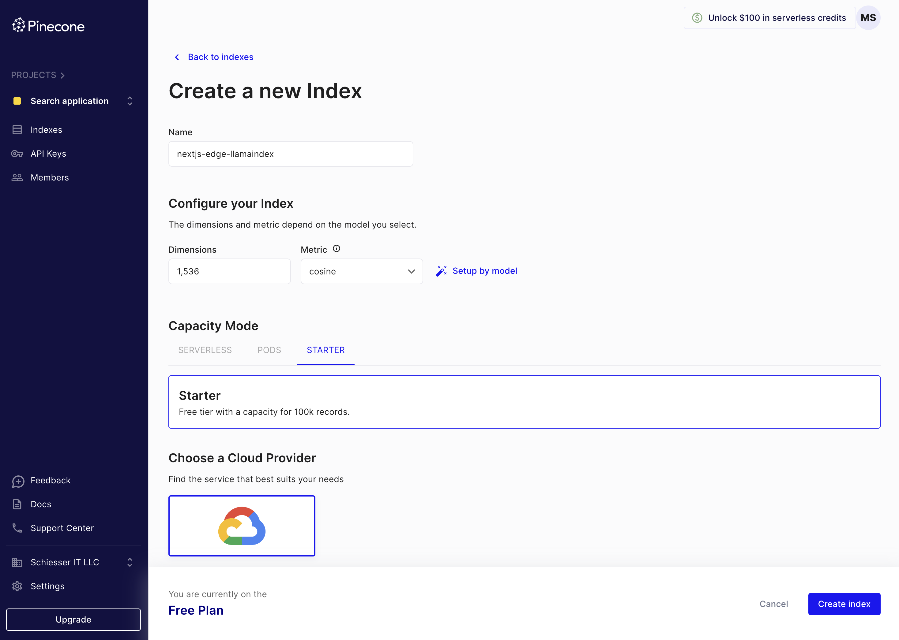
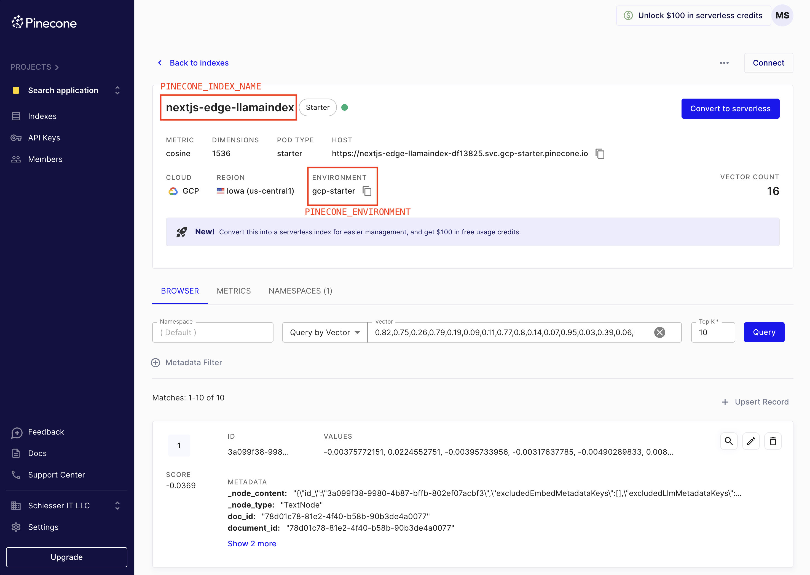
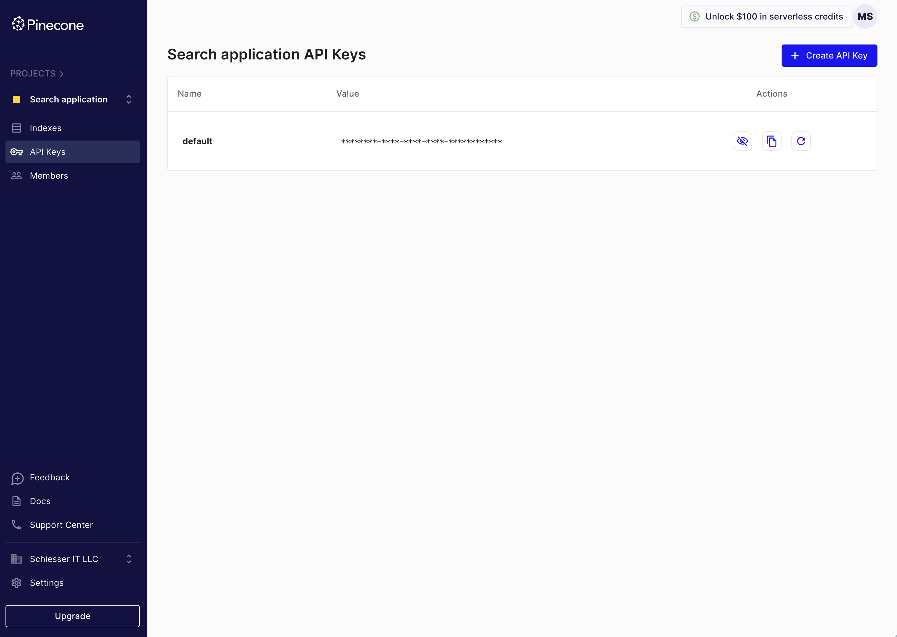

# LlamaIndexTS example with Next.JS using Edge runtime

This is a [LlamaIndex](https://www.llamaindex.ai/) project using [Next.js](https://nextjs.org/) bootstrapped with [`create-llama`](https://github.com/run-llama/LlamaIndexTS/tree/main/packages/create-llama).

It's using the [Edge runtime](https://nextjs.org/docs/pages/api-reference/edge) from NextJS and [Pinecone](https://www.pinecone.io/) as the vector database.

As the default PDF reader from LlamaIndexTS does not support the Edge runtime, we're using [LlamaParse](https://ts.llamaindex.ai/modules/data_loader#llamaparse) to parse the PDF documents.

## Setting up the environment

To use the application, you have to add the Pinecone, OpenAI, and LlamaParse configurations to the `.env` file.

We provide a `.env.template` file to help you get started. Copy the `.env.template` file to `.env` and fill in the values that you will retrieve in the following sections.

### Pinecone

First, you'll need a Pinecone account; go to https://www.pinecone.io to sign up for free.
Then proceed as follows:

1 . Create an index with 1536 dimensions (vector size of the default OpenAI embeddings model `text-embedding-ada-002`):



2. Retrieve the `PINECONE_INDEX_NAME` and `PINECONE_ENVIRONMENT` values and set them in the `.env` file:



3. Retrieve the API key and set it as `PINECONE_API_KEY` in the `.env` file:



### OpenAI

Create an OpenAI key from https://platform.openai.com/api-keys and set it as `OPENAI_API_KEY` in the `.env` file.

### LlamaParse

LlamaParse is an API created by LlamaIndex to parse files efficiently; for example, it's excellent at converting PDF tables into markdown.

To use it, get an API key from https://cloud.llamaindex.ai. Store the key in the `.env` file under the `LLAMA_CLOUD_API_KEY` variable.

## Getting Started

First, install the dependencies:

```
npm install
```

Second, generate the embeddings of the documents in the `./data` directory (if this folder exists - otherwise, skip this step):

```
npm run generate
```

Third, run the development server:

```
npm run dev
```

Open [http://localhost:3000](http://localhost:3000) with your browser to see the result.

You can start editing the page by modifying `app/page.tsx`. The page auto-updates as you edit the file.

This project uses [`next/font`](https://nextjs.org/docs/basic-features/font-optimization) to automatically optimize and load Inter, a custom Google Font.

## Learn More

To learn more about LlamaIndex, take a look at the following resources:

- [LlamaIndex Documentation](https://docs.llamaindex.ai) - learn about LlamaIndex (Python features).
- [LlamaIndexTS Documentation](https://ts.llamaindex.ai) - learn about LlamaIndex (Typescript features).

You can check out [the LlamaIndexTS GitHub repository](https://github.com/run-llama/LlamaIndexTS) - your feedback and contributions are welcome!
